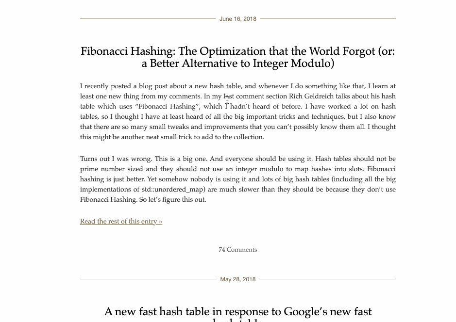

# Podsvechnik - English syntax highlighter as a Chrome plugin

This plugin is based on https://english.edward.io/. It may improve the speed at which you read English text.

Install the plugin, highligh the text and select the plugin action from the context menu.

# Why highlight English syntax?

It feels like a natural evolution of readability improvements. Earlier on, human scripts didn't have spaces between words, capital letters or punctuation. Then we started using them. Now technologies can help us reveal the structure of the sentence even faster.

# Tools I used while working on this README

- https://packagecontrol.io/packages/MarkdownPreview
- https://www.cockos.com/licecap/
